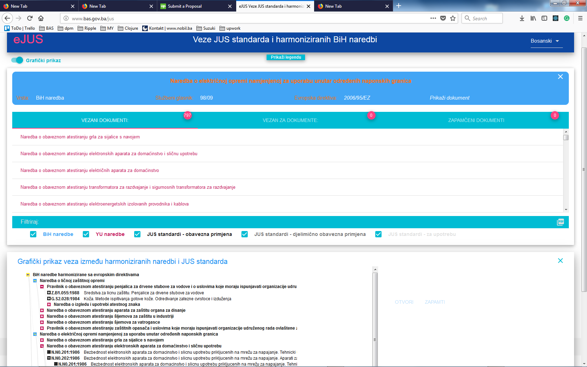

# eJUS

web: http://www.bas.gov.ba/jus

 
The main purpose of this application is the presentation of data about B&H directives, former Yugoslavia directives, 
and standards (JUS standards).

Documents are organized as the tree structure on the top of which are B&H directives connected with YU directives 
and on the bottom are JUS standards connected with them. There are three types of JUS standards with different 
levels of obligatoriness. 

Every type of document has its own color as shown in *Legend*.  

You can search for documents with autocomplete input. For an open document, you can see basic information and and 
list of all documents connected to it as well as documents it is connected to.

Also, you can save (remember) documents of your interest for later investigation.

You can switch on toggle *Graph View* to show graphic presentation of all connections on the bottom of the screen.

## License

Aplication is made in Clojure/Clojurescript. 

Template https://github.com/sveri/closp has been used for server (backend) part.

Database is Sqlite, frontend application is made with Reagent (https://github.com/reagent-project/reagent) and D3.js

Copyright © 2017 **Institut for standardization BiH** http://www.isbih.gov.ba

